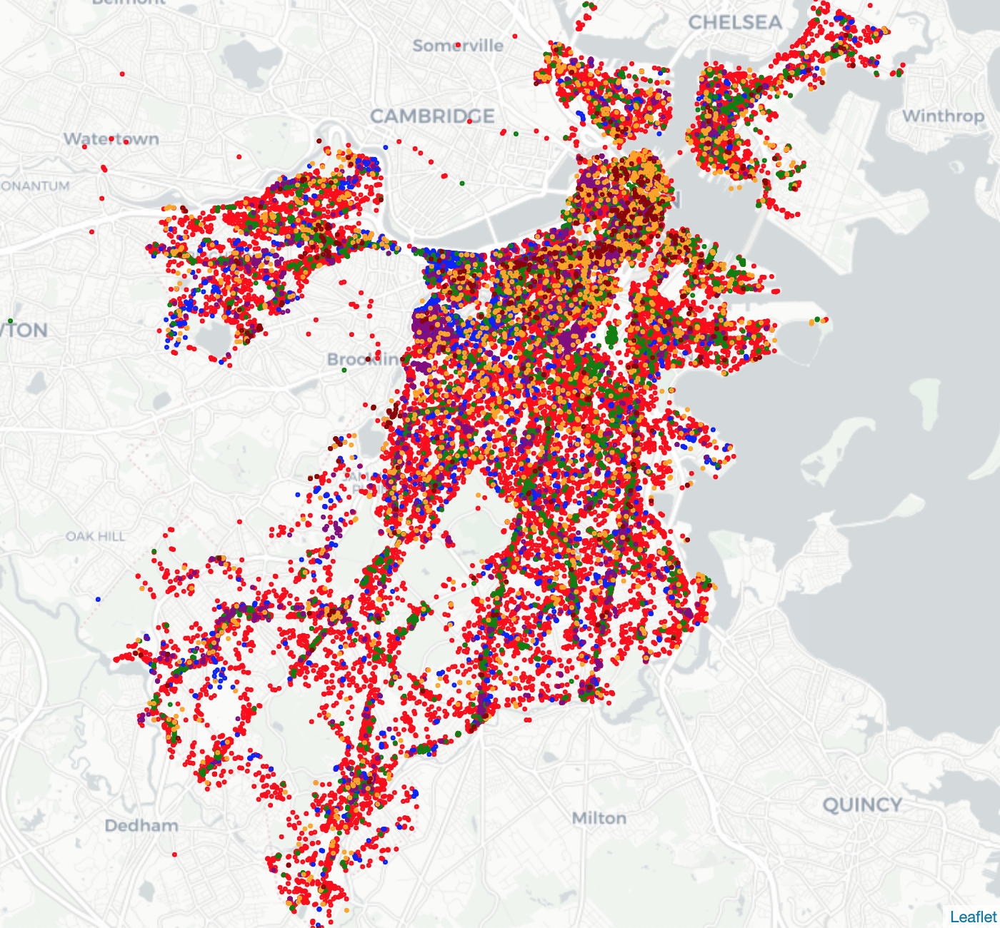
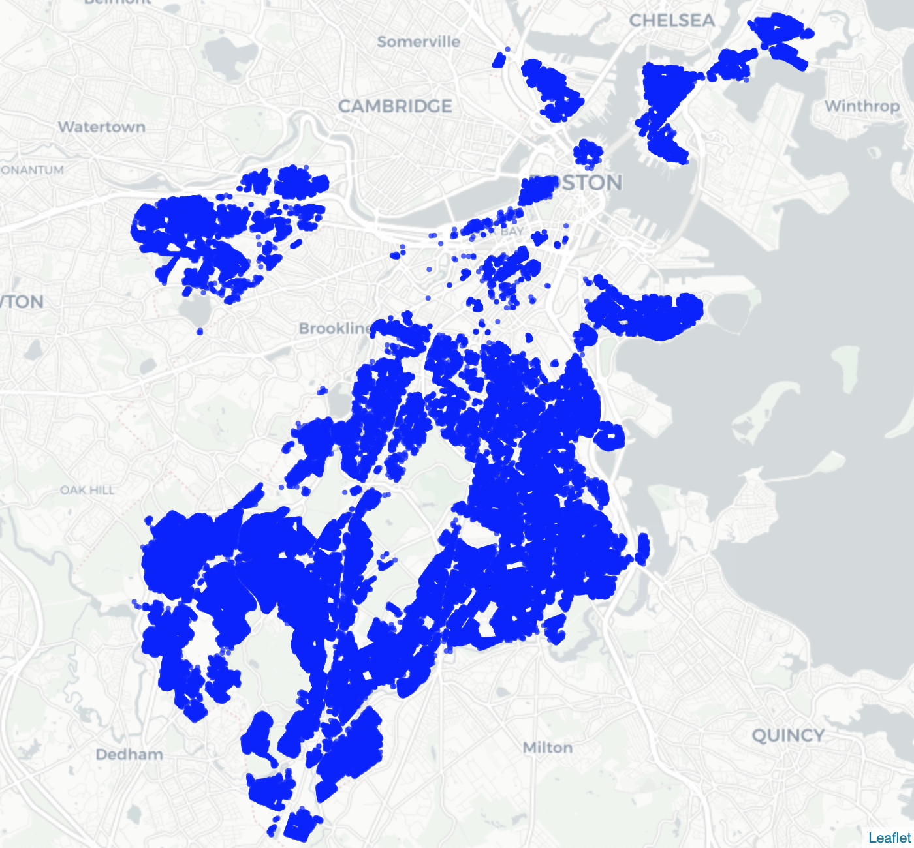
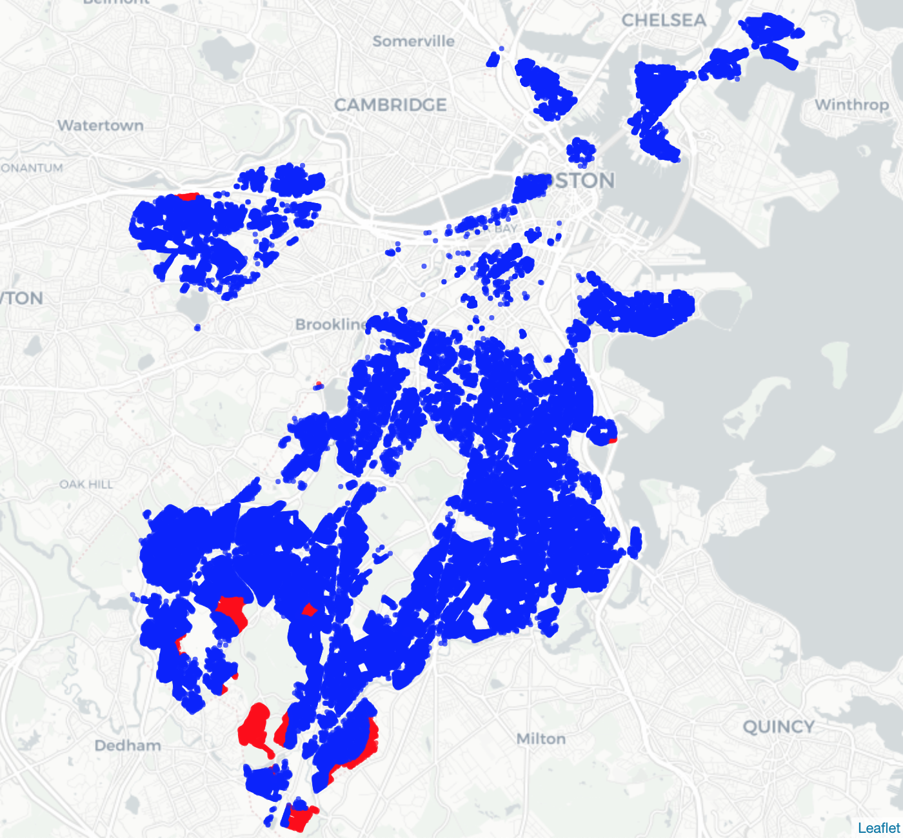
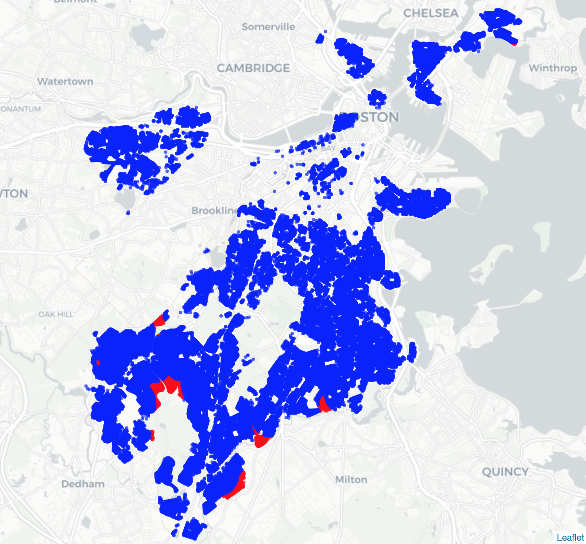
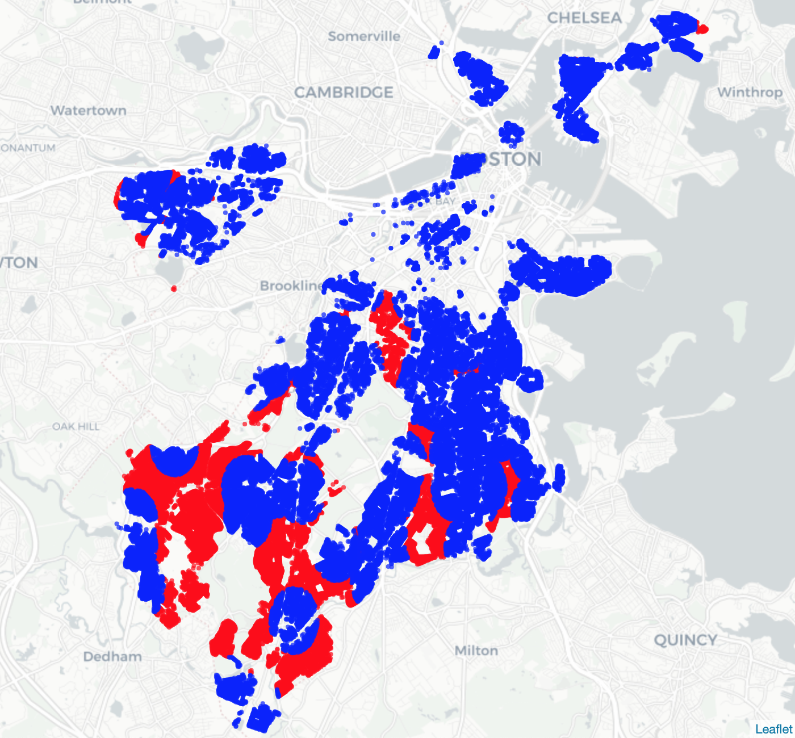

Deliverable 3: Report First Draft
================
Urban Mechanics Team 2

At this point in our analysis, the number parcels with 15-minute access
to each type of amenity have been determined. Some analysis has also
been completed regarding relationship between areas with amenity access
and demographics of those same areas.

## General insights

Overall, there seems to be a broad distribution of all amenity types.
The map below displays all amenities. Though it is somewhat difficult to
differentiate color; commercial corresponds to red, education to blue,
food access to green, health to purple, recreation to orange, and social
to dark red.

Discerning specific amenities from this figure is difficult, however it
is obvious that each color is fairly well distributed throughout Boston.
Some of the amenities are outside Boston; this may need to be controlled
in a future analysis. Overall, there were 0 parcels that lacked all
amenities, mostly because every parcel was within 15 minutes of a
commercial amenity, and there were 16,033 out of 62,190 parcels (25.8%)
that lacked at least one amenity.

It should also be noted that the analyses were carried out for only
residential parcels. That is, only distances from residential parcels to
amenities were considered in order to cut down on calculation time (of
course, amenities did not have to be on residential parcels).

## Commercial

There were no parcels without access to commercial amenities. This is
equal across zip codes and demographics.

## Education

1.4% of parcels do not have access to education amenities.

## Food Access

1.8% of parcels do not have access to food access amenities.

## Healthcare

2.9% of parcels do not have access to healthcare amenities.

## Recreation

2.3% of parcels do not have access to recreation amenities.

## Social

24.1% of parcels do not have access to social amenities.

## Next Steps

As we move further towards completion of the project, there is still
some cleaning and analysis to be done. All the above analysis was
completed using a simple distance algorithm—a more complex algorithm
that better accounts for the network of traffic and streets in Boston
should be developed. Additionally, the analysis has so far been carried
out based on walking times; biking times should be added in the next
iteration of this report.

There were also some problems with classification and calculation time
that came up with this analysis; some of the datasets may need to be
reclassified, and others may need to be filtered to cut down on
calculation time.

Lastly, closer analysis should be done with other demographic factors
and regarding specific combinations of amenity access or lack thereof.
