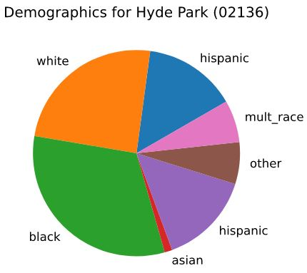
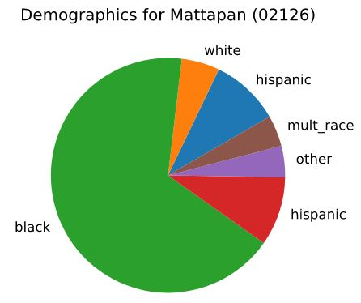
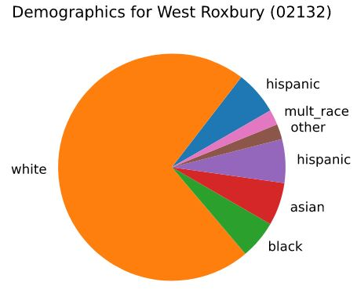

Deliverable 4: Report Final Draft
================
Urban Mechanics Team 2

# First insights into Boston as a 15 minute city

Darren Liu, Katie Lee, Khaled Sulayman, Sandra Zhen  
Boston University  
Boston Urban Mechanics Team 2  
CS506: Computational Tools for Data Science  

Note that this report may also be found as a pdf
[here](final_report.pdf).

## Introduction

In response to COVID19, Boston, among 96 other cities in the C40, have
committed to a “green and just recovery.” Among many things, cities in
the C40 have committed to making sure that all their residents have safe
and green methods to access fundamental resources and amenities so that
their cities are more resilient to future health crises. Such an idea is
encapsulated by the “15 minute city” or a city where every resident has
access to essential services and amenities within a 15 minute walk or
bike ride. The 15 minute city is not a new concept as cities like
Melbourne and Paris have already implemented measures to help promote
equitable access. Boston is looking to start building a 15 minute city
and thus, we are working with Boston’s New Urban Development team to
help start such development. We want to identify parcels that don’t have
access to amenities within a 15 minute walk/bike within the city of
Boston and identify specifically who and where is Boston lacking.
Ideally, we would like to identify zip codes or general areas of Boston
that need further development of essential services to help advise
future city planning. We have four key questions we want to answer:

1.  What amenities in Boston belong to each of the six categories of
    essential amenities necessary for a 15-minute city?
2.  What percentage of parcels are within 15 minutes of essential
    amenities?
3.  Which areas of the city are underserved in terms of a lack of
    essential amenities, and which amenities are they missing?
4.  What are the demographics of the underserved (non-15-minute)
    communities?

## Methodology

We defined 6 different types of amenities: healthcare, commercial,
social, food access, education, and recreation. The categorization of
amenities is fairly intuitive. Healthcare encapsulates all of the
hospitals and pharmacies and education includes schools and
universities. Food access amenities consist of parcels that provide
access to bulk food and does not include restaurants, cafes, etc. The
latter do not tend to promote general food access and are placed under
different categories. Recreational amenities promote general leisure and
sport, which includes places like parks and gyms. Social amenities
encourage interactions between people and emcompasses places like cafes,
bars, and places of worship. Commercial amenities are the general
“catch-all” for other amenities that are not strictly residential.

For reference, “spatial analysis” will refer to how we dealt with
determining which amenities are close to each parcel. We performed two
different types of spatial analysis which will be referred to as
“simple” and “complex”. For simple analysis, we first layered a grid on
top of a map of Boston. For every residential parcel, we drew a circle
around it with its radius being the distance that we estimated a person
could walk 15 minutes for. We did not take into account streets, the
Charles, or general spatial obstacles; We assumed a person could walk in
a straight line from the residential parcel to each amenity. We then
checked which types of amenities were present within that radius.

For complex analysis, we took street data into a network graph with the
lengths as weights. For every street intersection, we made an ego graph
with each of the connections being other street intersections that are
within 15 minutes. We then took each residential parcel and amenity and
assigned it to a street segment. We then assumed each parcel/amenity to
be at either end of the street and assigned each parcel/amenity to an
intersection. Using the corresponding ego graphs, we then checked each
connection in the ego graph for a given residential parcel to see if it
was connected to an amenity

## Directories in GitHub repository

All code can be viewed
[here](https://github.com/BU-Spark/CS506Spring2021Repository/tree/master/CityOfBoston_team2).

### Dependencies

-   Jupyter notebook
-   Pandas
-   Numpy
-   Os
-   Folium
-   pyproj
-   ast
-   GeoPandas
-   NetworkX
-   Shapely

### code

The preprocessing folder contains all the code that was used to clean
the separate raw datasets. These programs span businesses, greenspaces,
healthcare, schools, etc. The programs are a combination of both python
and jupyter notebook files. These files output cleaned CSV files to
datasets\_clean.

The maps folder contains html files that are used for figures regarding
our general spatial analysis.

The demographics folder contains the program we used for our demographic
analysis of the general Boston area and the specific zip codes of
interest. The maps folder within the demographics directory contains
html files that visualize our demographics analysis.

merge.py is used to merge all of the cleaned datasets together,
distance.py runs to the simple analysis, and distance\_crawl.py will
perform the complex spatial analysis.

### dataset\_ignore

The dataset\_ignore folder is the folder that would have contained the
raw datasets. We intentionally did not push these datasets to Github as
they are generally large. Refer to the preprocessing code for raw
datasets.

### datasets\_clean

Each of the cleaned datasets (that is the output of the preprocessing
code) are within this folder and are generally self-explanatory. For
instance, “pharmacies\_sanitized.csv” contains cleaned data about
pharmacies in Boston. Each of the cleaned datasets generally contain
name, address, category, zip code, latitude, and longitude features.

The final merged dataset is called final\_merge.csv in this directory.
The features on it are name, zip, lat, lon, category, and address. Most
of these are self-explanatory. lat and lon correspond to latitude and
longitude respectively, address refers to street address, and category
is amenity category. Each of the amenity datasets was standardized and
concatenated to create this dataset.

## Simple analysis discussion

To be succinct, “under resourced” parcels will refer to parcels that are
missing at least one type of amenity within its radius and “well
resourced” parcels will refer to parcels that are not missing any
amenity types within its radius. Through our simple spatial analysis,
most of the parcels in the main Boston area are well resourced (Figure
1). Most of the under resourced parcels are further away from the main
Boston area. Looking at each of the coverage of each individual amenity,
most amenities covered most of Boston. Social amenities, however, were
sparse and most of the under resourced parcels in Figure 1 are due to
the lack of a social amenity (Figure 2). The social amenity was very
lacking and was considerably smaller than the other amenities. Talks
with Nayeli and Kat also revealed that we were missing some residential
parcels in the main Boston area. In the complex analysis, we added the
missing residential parcels and refurbished the social amenity.

## Complex spatial discussion

In general, we can see that our results from our simple analysis and
complex analysis are consistent, strengthening our confidence in our
results. Most of the underserved parcels are in south Boston, which make
sense as they are further from the more metropolitan parts of Boston.
78.42% of all residential parcels are 15 minutes within each type of
amenity. Major places of interest are Mattapan, Hyde Park, and West
Roxbury.

Demographics

## Limitations

We looked at whether at least one of each type of parcel was within each
residential amenity. However, a more interesting analysis would be to
look at the density/quality of each amenity for a given parcel. For
instance, a parcel with only one bodega vs a parcel with 4 high quality
supermarkets are treated equally under our algorithm even though the
first parcel is more underserved than the second. As a quick aside, we
expect the computational complexity of such a problem to be immense. Our
current complex analysis takes a couple of hours to run and we expect
this time to exponentially increase when looking at density.

The main limitation of the simple analysis is how we assume that a
person can walk in a straight line from their residential to the amenity
in question. In reality, people are subject to obstacles such as rivers
and streets that prevent the most optimal movement. The simple analysis
model was built mostly to help build confidence in our complex analysis.

Our complex spatial analysis, while more nuanced than the simple
analysis, is much more computationally heavy. We expect this to be a
result of the sheer amount of parcels. For future analysis, we believe
that there should be a focus on the quality of parcels rather than the
quantity. For instance, there are a much higher amount of commercial
parcels than other type of amenity. Commercial amenities are much less
interesting as they clearly cover all of Boston, but add unnecessary
computational complexity to our programs. Ideally, we could identify and
remove amenities that are redundant and/or remove amenities that are not
important. Such a task is much easier said than done though and would
require a deep dive into all of our datasets.

## Discussion of our essential questions

As for question 1, the specifics of classification are discussed in the
Methodology section. As for question 2, 78.42% of all parcels are within
15 minutes of each type of amenity. As for question 3 and 4, these
questions are answered in the discussion of our simple and complex
analysis.
