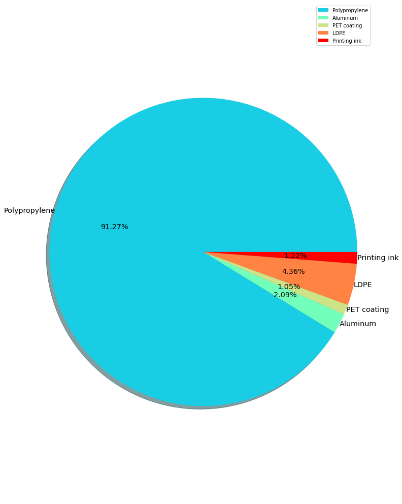

## Project Deliverable 2

More data should have been collected to perform a more thorough analysis of the data and attempt to answer one additional question relevant to your project proposal which you will submit as a pull request.

### Checklist

- [ ] Collect and pre-process a secondary batch of data
- [x] Refine the preliminary analysis of the data performed in PD1
- [x] Answer another key question
- [x] Refine project scope and list of limitations with data and potential risks of achieving project goal
- [x] Submit a PR with the above report and modifications to original proposal

### Refine the preliminary analysis

We added two charts for the total waste volume of each material included in K-cup and creamer waste in our code.

### Refine project scope

Add more questions to be answered in our analysis:

- What are ways the University could ask the vendors to change the options they offer ? e.g. buy less K-cup, more bag coffee

- Comparison between the weight of each componets for the coffee and creamer waste

Some suggestions for the presentation of our analysis:

- Convert the Label name in D1 to readable label for the mid-semester presentation

### Answer another question

```
Componets for Plastic coffee pod
total: 3.0213 g
Shell total: 1.7908 g + 0.7841 g (ring) = 2.5749 g[Polypropylene]
Lid total: 0.2462 g = Aluminum (24%) PET coating (12%) LDPE (50%) Printing ink (14%)
Filter Total: 0.2002 g (6.63%) = Kraft paper, bleached (79%) + LDPE (21%)
```

Reference: 

[Life Cycle Assessment of Compostable Coffee Pods: A US University Based Case Study](https://www.nature.com/articles/s41598-020-65058-1/tables/3)

```
Total waste weight for top 10 K-Cup Coffee:
total weight:  1512184.8204  g
total weight of Polypropylene:  1288758.0492  g
total weight of Aluminum: 29580.0228 g
total weight of PET coating:  14764.985999999999  g
total weight of LDPE:  82633.8708  g
total weight of Printing ink:  17267.526  g
total weight of bleached Kraft paper:  79180.3656  g
```


```
Total waste weight for the top two creams: ITD102042 + NES753032
total weight:  4477.5036  g

total weight of Polypropylene:  3815.9481083109918  g

total weight of Aluminum: 87.58496764968721 g

total weight of Printing ink:  51.12828060768544  g

total weight of PET coating:  43.71838486744116  g

total weight of LDPE:  182.4316331248138  g
```

