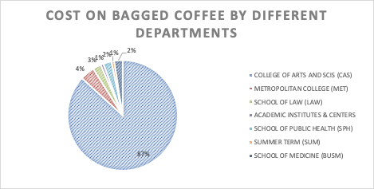
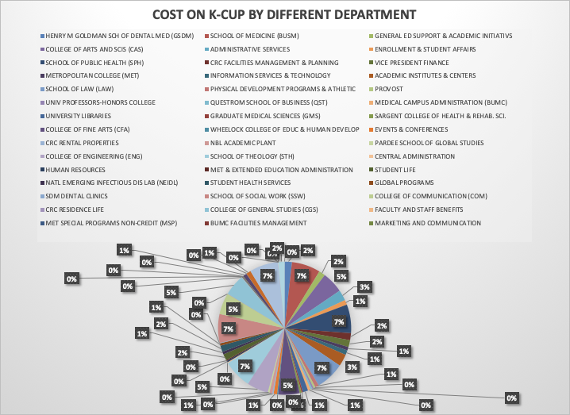
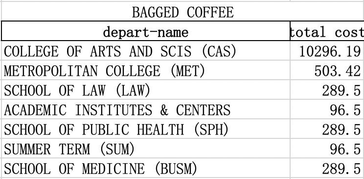
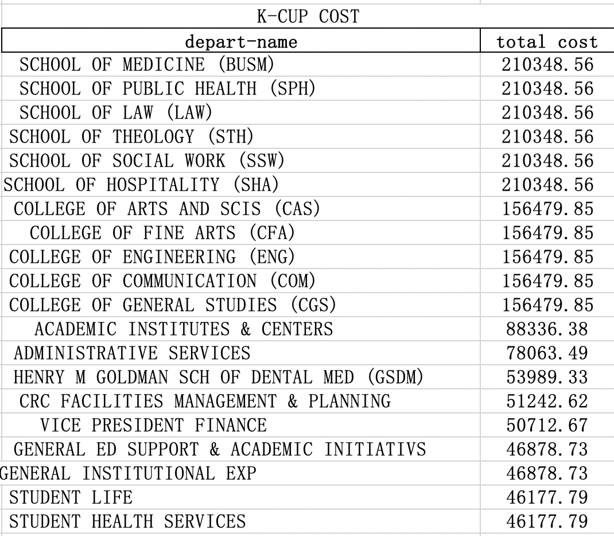
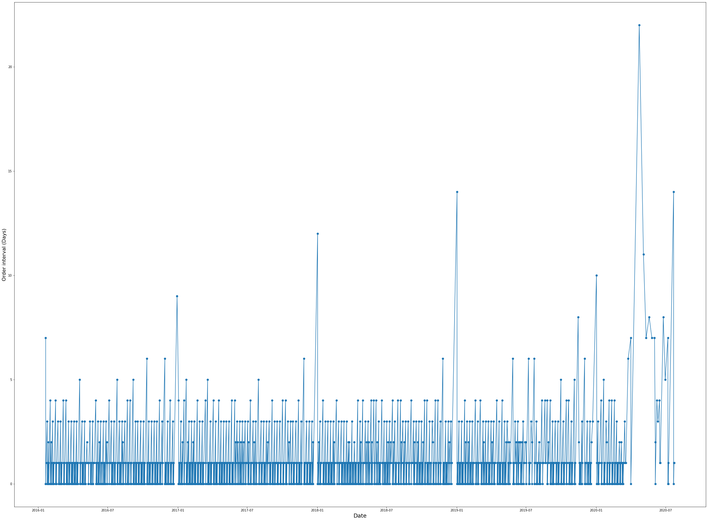
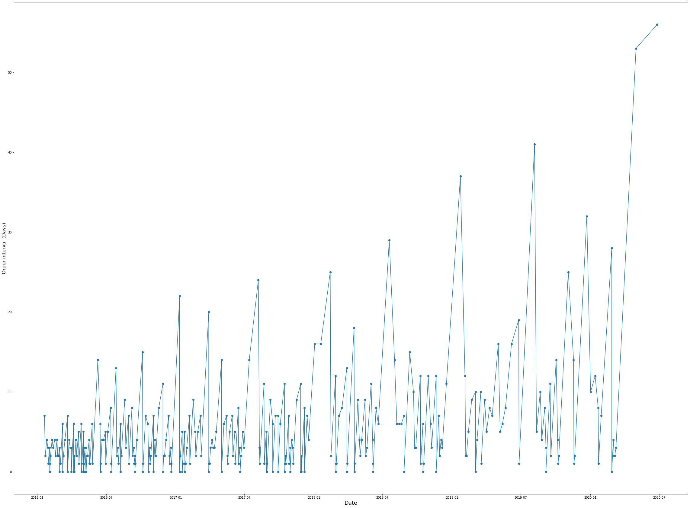
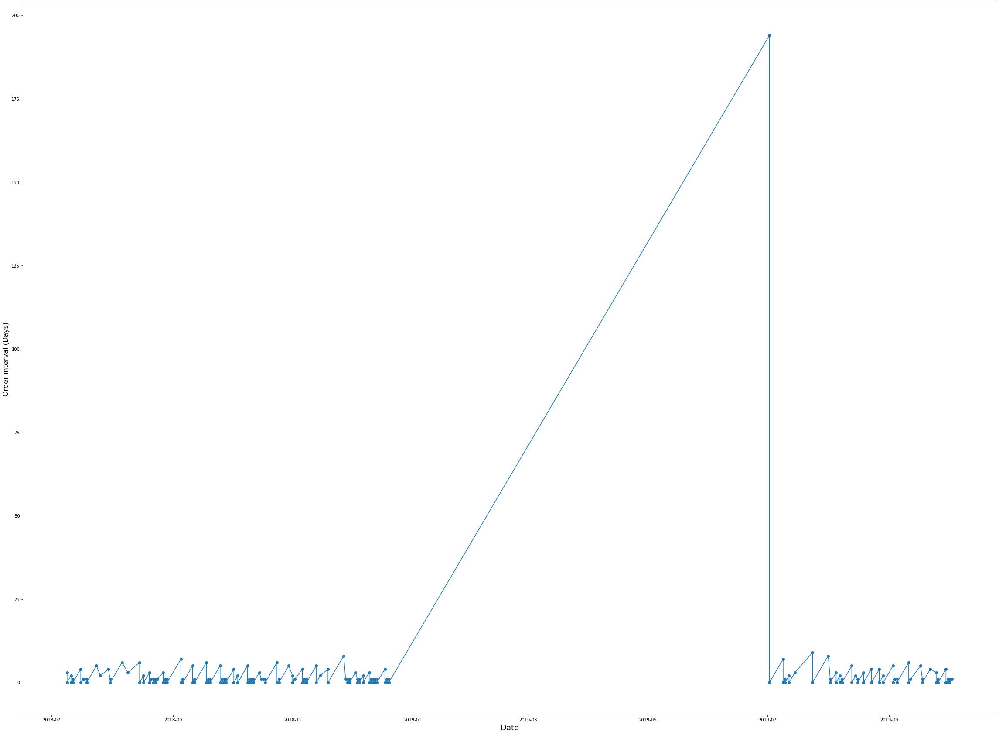

### Project Deliverable 3 (v1 Final Report)

All data should have been collected. All project questions should have been reviewed, answered, and submitted in a written document outlining findings as a PR. You will also be asked to submit the associated data and a README explaining what each label/feature in your dataset represents. Your team should meet with the client before this deliverable.

#### Checklist

- [x] All data is collected
- [x] Refine the preliminary analysis of the data performed in PD1&2
- [x] Answer another key question
- [x] Attempt to answer overarching project question
- [x] Create a draft of your final report
- [x] Refine project scope and list of limitations with data and potential risks of achieving project goal
- [x] Submit a PR with the above report and modifications to original proposal

#### Refine all the preliminary analysis of the data in PD2

##### Carbon emission estimate of top 10 K-Cup

We get the top-10 K-Cup shopped by the university. Due to our research, we found that although the ten products are from different companies, they have the same supplier -Keurig Dr Pepper. From Keurig Dr Pepper’s sustainability report 2019 , we found that all the K-cups are made of 100%  Polypropylene(PP). (source not input yet)1 g of pp = 1.886g of carbon emissions. From the product description, we investigated that Weight of a K-cup (g) is 14g. Using this information, we calculated that the carbon emissions of a K-Cup is 26.4g.

##### Carbon emission estimate of top 10 consumed ground coffee

For Ground coffee, we found that the carbon emission of growing a single arabica coffee in an environmentally friendly way is 3.5 kg CO2. We ignore the carbon emission during the process of smashing the coffee beans to coffee powder, and assume that 1 kg coffee bean would produce 1 kg ground coffee.
In addition,  we found that these top 10 ground coffee products  almost have similar packing bags,  and the component of its packing material is mainly polypropylene; So we assume they all have an average weight of 0.01 pound , which is the same as 5 g as the weight of an egg.  
We compute the carbon emission of this packing bag is 1.886g CO2.  Finally we add these two measurements together to obtain an estimate of carbon emission of producing each ground coffee product.
By collecting carbon emissions of producing the packing materials(eg. plastic bag) and coffee itself, we compute the carbon emission of top 10 consumed ground coffee is about 233.52616kg carbon dioxide.

##### Carbon emission estimate of top 10 consumed coffee creamer 

For coffee creamer, we firstly found the carbon emission of the packing of the product. We used the data that reported from a Chinese resource paper, and the average carbon emission of producing a 100 square meter carton is 70.7175 kg CO2, and we assume the carton used is a cube with length 6 inches, then the area of carton material used is 0.139 squared meter and then calculate the carbon emission of carton.

And then we multiply the average carbon emission of producing an individual plastic coffee pod  with the total amount of cups in one product to obtain the carbon emission of only creamer products there. Finally plus the carbon emission of packing and coffee creamer together to obtain the total carbon emission there.
By collecting carbon emission of producing the packing materials(eg. carton or cardboard box), and cup of the creamer, we compute the carbon emission of the top 10 consumed coffee creamer is about 14021.788kg carbon dioxide.

#### More analysis

- We calculated the cost that different departments spent on K-cups and Bagged Coffee. 54 departments spend a total of 3021641.13 dollars on buying K-cups. To elaborate, SCHOOL OF MEDICINE (BUSM) , SCHOOL OF PUBLIC HEALTH (SPH) ,SCHOOL OF LAW (LAW), SCHOOL OF THEOLOGY (STH), SCHOOL OF SOCIAL WORK (SSW), and SCHOOL OF HOSPITALITY (SHA) spent the most on the K-cups, with 210348.56 dollars. SUMMER TERM (SUM) spent the least, with 54.39 dollars. 7 departments spent a total of 11861.11 dollars on the Bagged Coffee. COLLEGE OF ARTS AND SCIS (CAS) spent the most with 10296.19 dollars. SUMMER TERM (SUM) and ACADEMIC INSTITUTES & CENTERS spent the least with 96.5 dollars. 

- We’ve computed the top 10 departments that requested Toner and Coffee most in the last 5 years respectively. Due to Covid-19, the demand dramatically decreases in the year 2020. However, the big picture turns out that colleges GSDM, BUSM, CAS, and GENERAL ED SUPPORT & ACADEMIC INITIATIVS have the most demands for both toner and coffee. BU could pay attention to these four colleges, and appropriately higher the price of the coffee and toner or remove several supply machines in the buildings.

- We analyzed the order frequency of coffee and toner, represented the top ten items in the order times in these two categories, and drew a line chart of the order frequency of that 20 most frequently used items. 

- For coffee, using the most commonly used coffee as the representation of the rest nine coffee products, which product code is GMT6520, Breakfast Blend Coffee K-Cup Pods, is ordered every 0.7 days on average. And the data is mainly concentrated between ordering multiple times a day to ordering once every three days. There are only a few cases where the interval between two orders exceeds five days. These large intervals mainly occur during holidays when the office was closed by tracing back to the order date. 2020 is the year in which large intervals frequently occur, with cases where the interval between two purchases is as long as 20 days because of the remote working/teaching pattern affected by the epidemic.

- For toner, using the most commonly used toner to represent the rest nine toner products, which product code is HEWCE505A, Black Original LaserJet Toner Cartridge, is ordered every 5.1 days on average. The data is mainly concentrated between ordering multiple times a day to ordering once every eight days. There are many cases where the interval between two orders exceeds eight days. Compared with the coffee category, the toner interval is more scattered. We found that toner demand is different from daily habits but is more goal-driven, for example, an event or large meeting. Therefore, it is prone to fluctuate demand changes with irregular rhythms. 2020 is the year in which large intervals frequently occur, with cases where the interval between two purchases is as long as 26 days because of the remote working/teaching pattern affected by the epidemic.

- For paper, using the most frequent requests from the office, which is FIREWORX Colored Paper. It's ordered every 1.12 days on average. The data is mainly concentrated between ordering multiple times a day to ordering once every nine days. A large frequency interval occurs with 194 days from 2018-12-20 to 2019-07-02. It may happens due to some double ordering before and only to find that the demand is saturated later.

#### Attempt to answering overarching project questions

We found out that School of Medicine and School of Public Health behold one place in top 3 among the rank of ordering numbers and ordering spends from different departments of BU. It may contains some double ordering or some excessive requests based on the time interval of each same request from the department.

#### Limitations with data

- Lots of non-printing paper products occurring in the data like paper bowls etc. We filtered them out simply by checking if it contains key word "Reams", which may inaccurate and need to be improved either by a nice key word when searching and pulling the data from the source or an more exclusive filtering words for printing paper in the data.

- For the printing paper filtered out, it just provided us the total dollar spending on each request but it varied by the spend from 23 to 27300 ish dollars, and different printing paper products have different price units. It would be really hard to find out each unit price and converted it to a specific quantity. It would be better if the ordering request data was pulled out with quantity attributes at firsthand.

#### Refined Final Analysis Questions

- What are ways the University could influence purchasing on behalf of its departments as a result of the data analysis toward waste?

#### 4/8 client meeting

##### Helpful Links

- https://www.bu.edu/sustainability/files/2021/03/BU-Zero-Waste-Plan-web.pdf

- https://www.bu.edu/sustainability/files/2021/02/BU-Sustainability-Annual-Report-2020.pdf

##### Revised questions

- What are ways the University could influence purchasing on behalf of its departments as a result of the data analysis toward waste?
- What is the waste volume of the specified categories?
- What data is missing from the supplier that would help answer the above questions?

##### Follow-ups: New data analysis
- [x] Calculate interval of the purchase of the same product by the same department 
- [x] Compare cost spent by dept on various categories btw depts that purchase K-cups vs bagged coffee (this could be a way to influence departments that spend a lot of money on these categories to change their habits)
- [x] Determine any ordering patterns (by department) for paper and toner to deduce if there exists double requesting for toner or if the amount of each is reasonable compared to the other
- [x] Determine time interval for products each department is ordering (need more detail on the new paper and toner excel sheet as it does not contain quantity, just total spend)
- [x] Focus on top 10% of products ordered

