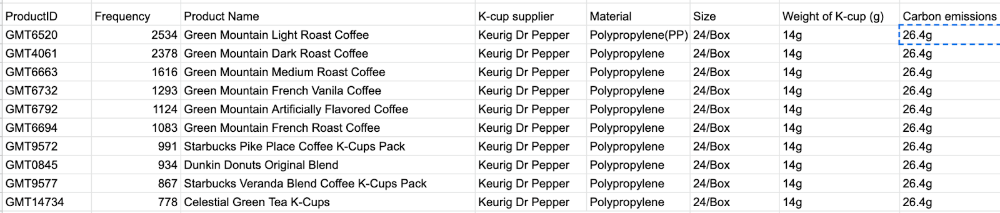

### Project Deliverable 4 (v2 Final Report)

This is a draft of your final report that has been reviewed by your client. It includes all visualizations, results, data, and code up to this point, along with proper documentation on how to reproduce your results, compile and use your codebase, and navigate your dataset. Your team will submit this as a PR.

### Project Description

The goal for the project is to explore the working supplies requests and expenditure from BU staff based on which we analyze the waste volume and GHG emission of the main categories (i.e. Coffee and Ink Cartridge) and their subcategories. According to the analysis, we are expected to provide some insightful suggestions regarding to BU sustainability in the future.


### Analysis Questions

* What is the waste volume of the specified categories?
* what is the weight of the waste to represent the waste volume of the products and use some carbon emission of the main material to represent product emission?
* What are ways the University could ask the vendors to change the options they offer ? e.g. buy less K-cup, more bag coffee
* What is the difference between the weight of each componets for the coffee and creamer waste

### Data description

We have received three batch of data from clients and collected two batch of supplemented data on our own.
* First batch of data is about the toner and coffee purchases from WB Mason including requisition ID, requisitioning date, description (of product), shopper ID and supplier part number. Based on it, we gathered data of waste volume and CO2 emission data for different types of coffee products.
* Second batch of data focuses on the spend of each request including department unit name, total invoice quantity and total paid etc.
* Third batch of data is about paper and toner requests from different departments and their branches including requisition ID, requisitioning date, description, unit name, fc name, etc.

### Deliverable 1

Procedure:
* We removed all data which has "Unclassified" value at the column for "Part - Supplier Part Number".
* We have calculated the number of requests for coffee and toner quarterly, monthly and yearly, and visualized the trends through ploting lines and bars.
* We have plotted pie charts for reavealing the top 20 coffee products and top 20 toner products respectively with the most number of requestes within 5 years and visualized their request numbers through the histogram.
* We found average waste value for plastic K-Cup Pods from online open source and estimated value for Coffee Creamer from Amazon to calculate waste weights for the top 20 coffee products with the most number of requests.

Conclusion: 
* In the recent five years, the total waste weight for the top 18 different types of K-cups with the most total number is 1.512 tons, and the total waste for the top 2 different types of coffee creamer with the most total number is 0.4 kg.

### Deliverable 2

Procedure:

* We have collected the packing type, weight and carbon emissions (if possible) for top 10 ground coffee, top 10 coffee creamer and top 10 K-Cup products in quantity from the categories of our previous analysis.

* We have collected the total weight, size, weight of toner and carbon emissions (if possible) for top 10 ink cartridge in quantity.

* We have received a secondary batch of data about the toner and coffee requests from different BU departments and do some pre-process of the data.

```
Componets for Plastic coffee pod
total: 3.0213 g
Shell total: 1.7908 g + 0.7841 g (ring) = 2.5749 g[Polypropylene]
Lid total: 0.2462 g = Aluminum (24%) PET coating (12%) LDPE (50%) Printing ink (14%)
Filter Total: 0.2002 g (6.63%) = Kraft paper, bleached (79%) + LDPE (21%)
```

Reference: 

[Life Cycle Assessment of Compostable Coffee Pods: A US University Based Case Study](https://www.nature.com/articles/s41598-020-65058-1/tables/3)

```
Total waste weight for top 10 K-Cup Coffee:
total weight:  1512184.8204  g
total weight of Polypropylene:  1288758.0492  g
total weight of Aluminum: 29580.0228 g
total weight of PET coating:  14764.985999999999  g
total weight of LDPE:  82633.8708  g
total weight of Printing ink:  17267.526  g
total weight of bleached Kraft paper:  79180.3656  g
```


```
Total waste weight for the top two creams: ITD102042 + NES753032
total weight:  4477.5036  g

total weight of Polypropylene:  3815.9481083109918  g

total weight of Aluminum: 87.58496764968721 g

total weight of Printing ink:  51.12828060768544  g

total weight of PET coating:  43.71838486744116  g

total weight of LDPE:  182.4316331248138  g
```


Conclusion:
We answered the following question:
* Total waste weight for top 10 K-Cup Coffee
* Total waste weight for the top two creams

### Deliverable 3

Procedure:
* We calculated carbon emission estimate of top 10 K-Cup, top 10 consumed ground coffee and top 10 consumed coffee creamer
* We calculated the cost that different departments spent on K-cups and Bagged Coffee, and the top 10 departments that requested Toner and Coffee most in the last 5 years respectively. 
* We analyzed the order frequency of coffee, toner and paper, represented the top ten items in the order times in these two categories, and drew a line chart of the order frequency of that 20 most frequently used items

##### Carbon emission estimate of top 10 K-Cup

We get the top-10 K-Cup shopped by the university. Due to our research, we found that although the ten products are from different companies, they have the same supplier -Keurig Dr Pepper. From Keurig Dr Pepper’s sustainability report 2019 , we found that all the K-cups are made of 100%  Polypropylene(PP). (source not input yet)1 g of pp = 1.886g of carbon emissions. From the product description, we investigated that Weight of a K-cup (g) is 14g. Using this information, we calculated that the carbon emissions of a K-Cup is 26.4g.



##### Carbon emission estimate of top 10 consumed ground coffee

For Ground coffee, we found that the carbon emission of growing a single arabica coffee in an environmentally friendly way is 3.5 kg CO2. We ignore the carbon emission during the process of smashing the coffee beans to coffee powder, and assume that 1 kg coffee bean would produce 1 kg ground coffee.
In addition,  we found that these top 10 ground coffee products  almost have similar packing bags,  and the component of its packing material is mainly polypropylene; So we assume they all have an average weight of 0.01 pound , which is the same as 5 g as the weight of an egg.  
We compute the carbon emission of this packing bag is 1.886g CO2.  Finally we add these two measurements together to obtain an estimate of carbon emission of producing each ground coffee product.
By collecting carbon emissions of producing the packing materials(eg. plastic bag) and coffee itself, we compute the carbon emission of top 10 consumed ground coffee is about 233.52616kg carbon dioxide.


##### Carbon emission estimate of top 10 consumed coffee creamer 

For coffee creamer, we firstly found the carbon emission of the packing of the product. We used the data that reported from a Chinese resource paper, and the average carbon emission of producing a 100 square meter carton is 70.7175 kg CO2, and we assume the carton used is a cube with length 6 inches, then the area of carton material used is 0.139 squared meter and then calculate the carbon emission of carton.

And then we multiply the average carbon emission of producing an individual plastic coffee pod  with the total amount of cups in one product to obtain the carbon emission of only creamer products there. Finally plus the carbon emission of packing and coffee creamer together to obtain the total carbon emission there.
By collecting carbon emission of producing the packing materials(eg. carton or cardboard box), and cup of the creamer, we compute the carbon emission of the top 10 consumed coffee creamer is about 14021.788kg carbon dioxide.


#### More analysis

- We calculated the cost that different departments spent on K-cups and Bagged Coffee. 54 departments spend a total of 3021641.13 dollars on buying K-cups. To elaborate, SCHOOL OF MEDICINE (BUSM) , SCHOOL OF PUBLIC HEALTH (SPH) ,SCHOOL OF LAW (LAW), SCHOOL OF THEOLOGY (STH), SCHOOL OF SOCIAL WORK (SSW), and SCHOOL OF HOSPITALITY (SHA) spent the most on the K-cups, with 210348.56 dollars. SUMMER TERM (SUM) spent the least, with 54.39 dollars. 7 departments spent a total of 11861.11 dollars on the Bagged Coffee. COLLEGE OF ARTS AND SCIS (CAS) spent the most with 10296.19 dollars. SUMMER TERM (SUM) and ACADEMIC INSTITUTES & CENTERS spent the least with 96.5 dollars. 


- We’ve computed the top 10 departments that requested Toner and Coffee most in the last 5 years respectively. Due to Covid-19, the demand dramatically decreases in the year 2020. However, the big picture turns out that colleges GSDM, BUSM, CAS, and GENERAL ED SUPPORT & ACADEMIC INITIATIVS have the most demands for both toner and coffee. BU could pay attention to these four colleges, and appropriately higher the price of the coffee and toner or remove several supply machines in the buildings.


- We analyzed the order frequency of coffee, toner and paper, represented the top ten items in the order times in these two categories, and drew a line chart of the order frequency of that 20 most frequently used items. 

- For coffee, using the most commonly used coffee as the representation of the rest nine coffee products, which product code is GMT6520, Breakfast Blend Coffee K-Cup Pods, is ordered every 0.7 days on average. And the data is mainly concentrated between ordering multiple times a day to ordering once every three days. There are only a few cases where the interval between two orders exceeds five days. These large intervals mainly occur during holidays when the office was closed by tracing back to the order date. 2020 is the year in which large intervals frequently occur, with cases where the interval between two purchases is as long as 20 days because of the remote working/teaching pattern affected by the epidemic.


- For toner, using the most commonly used toner to represent the rest nine toner products, which product code is HEWCE505A, Black Original LaserJet Toner Cartridge, is ordered every 5.1 days on average. The data is mainly concentrated between ordering multiple times a day to ordering once every eight days. There are many cases where the interval between two orders exceeds eight days. Compared with the coffee category, the toner interval is more scattered. We found that toner demand is different from daily habits but is more goal-driven, for example, an event or large meeting. Therefore, it is prone to fluctuate demand changes with irregular rhythms. 2020 is the year in which large intervals frequently occur, with cases where the interval between two purchases is as long as 26 days because of the remote working/teaching pattern affected by the epidemic.


- For paper, using the most frequent requests from the office, which is FIREWORX Colored Paper. It's ordered every 1.12 days on average. The data is mainly concentrated between ordering multiple times a day to ordering once every nine days. A large frequency interval occurs with 194 days from 2018-12-20 to 2019-07-02. It may happens due to some double ordering before and only to find that the demand is saturated later.


#### Attempt to answering overarching project questions

We found out that School of Medicine and School of Public Health behold one place in top 3 among the rank of ordering numbers and ordering spends from different departments of BU. It may contains some double ordering or some excessive requests based on the time interval of each same request from the department.

#### Limitations with data

- Lots of non-printing paper products occurring in the data like paper bowls etc. We filtered them out simply by checking if it contains key word "Reams", which may inaccurate and need to be improved either by a nice key word when searching and pulling the data from the source or an more exclusive filtering words for printing paper in the data.

- For the printing paper filtered out, it just provided us the total dollar spending on each request but it varied by the spend from 23 to 27300 ish dollars, and different printing paper products have different price units. It would be really hard to find out each unit price and converted it to a specific quantity. It would be better if the ordering request data was pulled out with quantity attributes at firsthand.

Conclusion: 
* The carbon emissions of a K-Cup is 26.4g.
* The carbon emission of top 10 consumed ground coffee is about 233.52616kg carbon dioxide.
* The carbon emission of the top 10 consumed coffee creamer is about 14021.788kg carbon dioxide.
* School of Medicine and School of Public Health behold one place in top 3 among the rank of ordering numbers and ordering spends from different departments of BU.
* K-Cup coffee pods is ordered every 0.7 days on average, toner cartridge is ordered every 5.1 days on average and paper is ordered every 1.12 days on average. 
