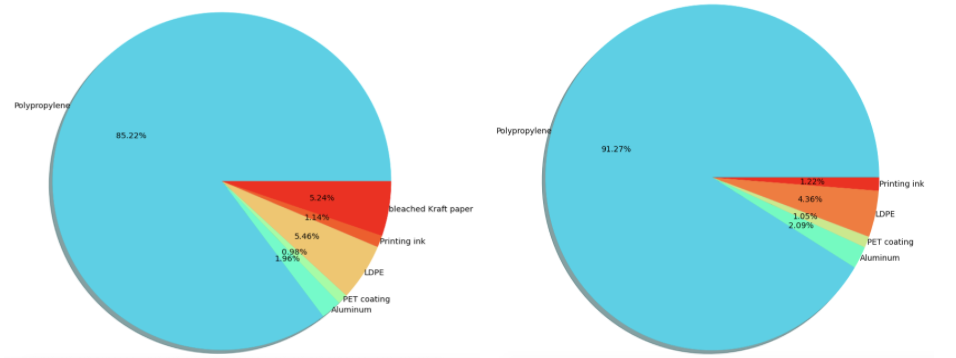

# Final Project Deliverable

Here is [ipython notebook](./Analysis_Code.ipynb) for running all our codes for anlysis in one shot.

## Project Description

The goal for the project is to explore the working supplies requested by BU staff and their expenditure, based on which we analyze the waste volume and GHG emission of the main categories (i.e. Coffee and Ink Cartridge) and their subcategories. According to the analysis, we are expected to provide some insightful suggestions regarding to BU sustainability in the future.

## Analysis Questions

* What are the waste volumns for specified coffee categories and ink cartridges?
* What is the carbon emission for each coffee category?
* What is the purchasing pattern for specified coffer products, toners and paper? (i.e. days interval for each request of main categories from different departments)
* What are ways the University could ask the vendors to change the options they offer? How can vendors make changes to optimize the waste that the university can make. e.g. buy less K-cup, more bag coffee or give some benefit to the green product

## Data description

We have received [three batch of data](https://drive.google.com/drive/u/0/folders/1dXfd1e3VJ8bvrM_g_4fOpsyM90UHhyFw) from our clients. We also processed and augmented [five batch of supplemented data](https://drive.google.com/drive/u/0/folders/1f33F4wpTuIkZ6FU09ZoY6xBySCWtpRR3) on our own.

* First batch of data is about the toner and coffee purchases from WB Mason Company. Based on it, we gathered data of waste volume and CO2 emission data for different types of coffee products in four batch of data and waste volumes for toner products in the last supplemented data.

 *WB Mason Toner and Coffee Purchases_no pricing.csv* :
 ```
 Requistion ID                -- ID for each request
 Requesting date              -- date when the request being incurred in the following format DD/MM/YYYY
 Supplier-ERP Supplier        -- only one supplier, WB Mason Company
 Description                  -- including product name and/or product category code and capacity for each pack
 Requester - Shopper ID       -- ID for each shopper
 Part -- Supplier Part Number -- unique code that the supplier provides to identify the product
 Category                     -- Coffee or Toner
 ```

* Second batch of data focuses on the spend of each request including department unit name, total invoice quantity and total paid etc.

 *Department Mason spend.csv* :
 ```
 Vendor ID        -- only one vendor ID, 10572031
 Vendor           -- only one vendor number, 1000080
 Vendor Name      -- only one vendor, that is, WB Mason Company
 Type of Business -- only one usage for each request, office supplies & commercials
 PO creation date -- date when the request being incurred in the following format DD/MM/YYYY
 Product P/N      -- unique code that the supplier provides to identify the product
 Shopper          -- ID for each shopper
 Unit             -- ID for each department
 Unit name        -- each department name
 Total Paid       -- dollars spent on each request
 Upper part       -- same as Product P/N 
 Category         -- Coffee or Toner
 Description      -- including product name and/or product category code and capacity for each pack
 ```

* Third batch of data is about paper and toner requests from different departments and their branches including requisition ID, requisitioning date, description, unit name, fc name, etc.

 *WBMason paper and toner.csv* :
 ```
 Requistion ID                -- ID for each request
 Requesting date              -- the data that the request happen on the following format day/month/year
 Supplier-ERP Supplier        -- only one supplier, WB Mason Company
 Description                  -- including product name and/or product category code and capacity for each pack
 Requester - Shopper ID       -- ID for each shopper
 Part -- Supplier Part Number -- unique code that the supplier provides to identify the product
 Requisition Spend            -- spends for each requisition
 Category                     -- Toner/Ink or Paper
 Year Group                   -- the year when each request being incurred, ranging from 2018 to 2020
 Unit name                    -- each department name that made the request
 fc name                      -- each sector name of department that made the request
 ```

## Step 1

1. Clean Data - We removed all data which has "Unclassified" value at the column for "Part - Supplier Part Number".
2. Visualize Data - We have calculated the number of requests for coffee and toner quarterly, monthly and yearly, and visualized the trends through ploting lines and bars.
3. Visualize Data - We have plotted pie charts for reavealing the top 20 coffee products and top 20 toner products respectively with the most number of requestes within 5 years and visualized their request numbers through the histogram.
4. Data Research - We found average waste value for plastic K-Cup Pods from [online open source](https://www.nature.com/articles/s41598-020-65058-1/tables/3) and standard specifications of Coffee Creamer in [Amazon](https://www.amazon.com/International-Delight-102042-Coffee-Inspirations/dp/B0081V0BRM) to calculate waste weights for the top 20 frequently-ordered coffee products.

### Result: 
* What is the waste volume of the specified categories?

 From 2016 - 2021, the total waste weight for the top 18 frequently-ordered K-cups is 1.512 tons, and the total waste weight for the top 2 coffee creamer with the most total number is 4.5 kg.

## Step 2

1. Refine Analysis - We added two charts for the total waste volume of each material included in a K-cup and a creamer cup.



2. Coffee Data Research - We collected standard specification of each top 10 ground coffee, top 10 coffee creamer and top 10 K-Cup products, such as weight, packing material, packs number. Then we search the rough data of carbon emission of packing (polypropylene, cardbox, or carton), coffee, creamer, etc.

3. Toner Data Research - We collected the standard specification of each top 10 ink cartridge.

4. Collect Data - We received a secondary batch of data about the frequency of requests for the toner and coffee from different BU departments and we did some pre-processing of this data.

## Step 3

1. Data Calculation

 **a. Carbon emission estimates for top 10 frequently-requested K-Cups (2016-2020)**
 
 
 
 - We get the top-10 K-Cup requested by the university from 2016-2020. We found all K-cup coffee products are supplied from Keurig Company. 
 - From [Keurig Dr Pepper’s sustainability report 2019](https://www.keurigdrpepper.com/content/dam/keurig-brand-sites/kdp/files/KDP-CR-Report-2019.pdf), we found that all K-cups are made of around 87% Polypropylene(PP) with 1 g of PP producing 1.886g of carbon emissions.
 - From the product description, we investigated that the weight of a K-cup (g) is 14g. Using this information, we calculated that the carbon emissions of a K-Cup is 26.4g.
 
 

 **b. Carbon emission estimates for top 10 frequently-requested ground coffee (2016-2020)**

 - For Ground coffee, we found that the carbon emission of [growing a single arabica coffee in an environmental-friendly way is 3.5 kg CO2](https://theconversation.com/coffee-heres-the-carbon-cost-of-your-daily-cup-and-how-to-make-it-climate-friendly-152629). Here, we ignore the carbon emission during the process of smashing the coffee beans to coffee powder, and assume that 1 kg coffee bean would produce 1 kg ground coffee.
 - In addition,  we found that these top 10 ground coffee products  almost have similar packing bags, and the component of its packing material is mainly polypropylene; So we assume they all have an average weight of 0.01 pound , which is the same as 5 g as the weight of an egg. 
 - We computed the carbon emission of this packing bag is 1.886g CO2.
 - Finally we add these two measurements together to obtain an estimate of carbon emission for producing each ground coffee product.

 
 
 - By collecting carbon emissions of producing the packing materials(eg. plastic bag) and coffee itself, we compute the carbon emission of top 10 consumed ground coffee is about *233.52616 kg* carbon dioxide for 2016-2020.

 


 **c. Carbon emission estimates for top 10 frequently-requested coffee creamer (2016-2020)**

  - We found the carbon emission for the packing carton of each boxes of coffee creamer from paper [*Calculation Method and Case Analysis of Carbon Footprint in Corrugated Carton Production*](http://www.designartj.com/bzgcgk/ch/reader/create_pdf.aspx?file_no=201205024&year_id=2012&quarter_id=5&falg=1), from which the average carbon emission for producing a 100 square meter carton is 70.7175 kg CO2, and we assume the carton used is a cube with length 6 inches, then the area of carton material used is 0.139 squared meter and then calculate the carbon emission of carton.

  - Then we multiplied the average carbon emission for producing an individual plastic coffee pod with the total amount of cups in one product to obtain the carbon emission of only creamer products. (i.e. )
  
  - Finally plus the carbon emission of packing and coffee creamer together to obtain the total carbon emission there.
By collecting carbon emission of producing the packing materials(eg. carton or cardboard box), and cup of the creamer, we compute the carbon emission of the top 10 consumed coffee creamer is about 14021.788kg carbon dioxide.


#### Ordering time gap analysis

- We calculated the cost that different departments spent on K-cups and Bagged Coffee. 54 departments spend a total of 3021641.13 dollars on buying K-cups. To elaborate, SCHOOL OF MEDICINE (BUSM) , SCHOOL OF PUBLIC HEALTH (SPH) ,SCHOOL OF LAW (LAW), SCHOOL OF THEOLOGY (STH), SCHOOL OF SOCIAL WORK (SSW), and SCHOOL OF HOSPITALITY (SHA) spent the most on the K-cups, with 210348.56 dollars. SUMMER TERM (SUM) spent the least, with 54.39 dollars. 7 departments spent a total of 11861.11 dollars on the Bagged Coffee. COLLEGE OF ARTS AND SCIS (CAS) spent the most with 10296.19 dollars. SUMMER TERM (SUM) and ACADEMIC INSTITUTES & CENTERS spent the least with 96.5 dollars. 


- We’ve computed the top 10 departments that requested Toner and Coffee most in the last 5 years respectively. Due to Covid-19, the demand dramatically decreases in the year 2020. However, the big picture turns out that colleges GSDM, BUSM, CAS, and GENERAL ED SUPPORT & ACADEMIC INITIATIVS have the most demands for both toner and coffee. BU could pay attention to these four colleges, and appropriately higher the price of the coffee and toner or remove several supply machines in the buildings.


- We analyzed the order frequency of coffee, toner and paper, represented the top ten items in the order times in these two categories, and drew a line chart of the order frequency of that 20 most frequently used items. 

- For coffee, using the most commonly used coffee as the representation of the rest nine coffee products, which product code is GMT6520, Breakfast Blend Coffee K-Cup Pods, is ordered every 0.7 days on average. And the data is mainly concentrated between ordering multiple times a day to ordering once every three days. There are only a few cases where the interval between two orders exceeds five days. These large intervals mainly occur during holidays when the office was closed by tracing back to the order date. 2020 is the year in which large intervals frequently occur, with cases where the interval between two purchases is as long as 20 days because of the remote working/teaching pattern affected by the epidemic.


- For toner, using the most commonly used toner to represent the rest nine toner products, which product code is HEWCE505A, Black Original LaserJet Toner Cartridge, is ordered every 5.1 days on average. The data is mainly concentrated between ordering multiple times a day to ordering once every eight days. There are many cases where the interval between two orders exceeds eight days. Compared with the coffee category, the toner interval is more scattered. We found that toner demand is different from daily habits but is more goal-driven, for example, an event or large meeting. Therefore, it is prone to fluctuate demand changes with irregular rhythms. 2020 is the year in which large intervals frequently occur, with cases where the interval between two purchases is as long as 26 days because of the remote working/teaching pattern affected by the epidemic.


- For paper, using the most frequent requests from the office, which is FIREWORX Colored Paper. It's ordered every 1.12 days on average. The data is mainly concentrated between ordering multiple times a day to ordering once every nine days. A large frequency interval occurs with 194 days from 2018-12-20 to 2019-07-02. It may happens due to some double ordering before and only to find that the demand is saturated later.


- We also included the break down graph by college for top 5 most used coffee and toner.


#### Attempt to answering overarching project questions

We found out that School of Medicine and School of Public Health behold one place in top 3 among the rank of ordering numbers and ordering spends from different departments of BU. It may contains some double ordering or some excessive requests based on the time interval of each same request from the department.

#### Limitations with data

- Lots of non-printing paper products occurring in the data like paper bowls etc. We filtered them out simply by checking if it contains key word "Reams", which may inaccurate and need to be improved either by a nice key word when searching and pulling the data from the source or an more exclusive filtering words for printing paper in the data.

- For the printing paper filtered out, it just provided us the total dollar spending on each request but it varied by the spend from 23 to 27300 ish dollars, and different printing paper products have different price units. It would be really hard to find out each unit price and converted it to a specific quantity. It would be better if the ordering request data was pulled out with quantity attributes at firsthand.


Conclusion: 
* The carbon emissions of a K-Cup is 26.4g.
* The carbon emission of top 10 consumed ground coffee is about 233.52616kg carbon dioxide.
* The carbon emission of the top 10 consumed coffee creamer is about 14021.788kg carbon dioxide.
* School of Medicine and School of Public Health behold one place in top 3 among the rank of ordering numbers and ordering spends from different departments of BU.
* K-Cup coffee pods is ordered every 0.7 days on average, toner cartridge is ordered every 5.1 days on average and paper is ordered every 1.12 days on average. 

### Suggestions for BU Sustainbility

* Based on huge orderings from WB Mason Company, it would be better to have a "price discrimination" by dealing the products contributing larger waste volume or CO2 emission with a lower discount in price and those which are made of all (or most) recycled materials and considered less enviromental impact with a higher discount. At result, BU staff may change their purchasing behaviour and request those products which are good for sustainbility.