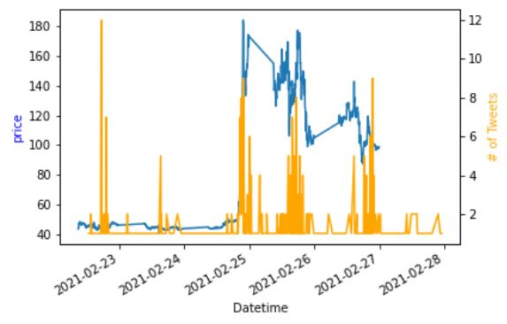

## Project Deliverable 1

### Project Specifics 
- [x] Test the following data sources:
    - Alpha Vantage
    - Twitter 
    - Yahoo Finance 
    - Finhub
- [x] Identify key attributes in each data source and limitations 
- [x] Plot price vs volume of tweets with $ tag

Sufficient data should have been collected to perform a preliminary analysis of the data and attempt to answer one question relevant to your project proposal which you will submit as a pull request. If data has already been collected for your project you must answer two questions.

#### Checklist

- [x] Collect and pre-process a preliminary batch of data
- [x] Perform a preliminary analysis of the data
- [x] Answer one key question
- [x] Refine project scope and list of limitations with data and potential risks of achieving project goal
- [x] Submit a PR with the above report and modifications to original proposal
