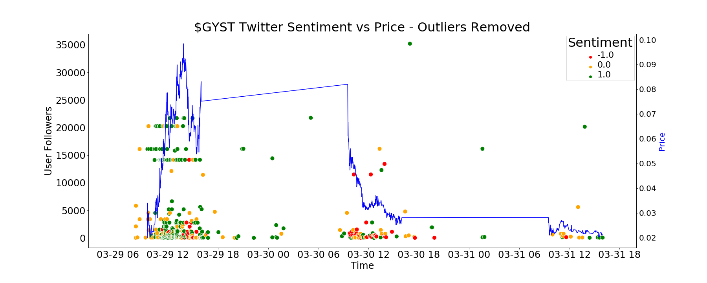

### Project Deliverable 3 (v1 Final Report)

All data should have been collected. All project questions should have been reviewed, answered, and submitted in a written document outlining findings as a PR. You will also be asked to submit the associated data and a README explaining what each label/feature in your dataset represents. Your team should meet with the client before this deliverable.

#### Checklist

- [X] All data is collected
- [X] Refine the preliminary analysis of the data performed in PD1&2
- [X] Answer another key question
- [X] Attempt to answer overarching project question
- [X] Create a draft of your final report
- [X] Refine project scope and list of limitations with data and potential risks of achieving project goal
- [X] Submit a PR with the above report and modifications to original proposal

#### Deliverable 3 Notes

Yifu was not available for our last meeting so we were unable to review our report/progress with him last week. However, we have a draft of our report provided in the "report" folder as a PDF. All data for the sentiment analysis portion of the project has been collected and analyzed. Next, we plan to use our sentiment model to build features in a price prediction model. Based on preliminary results it appears that sentiment is correlated with price movement as indicated by the plot below. 

Based on the plot above we clearly see that sentiment is generally positive towards the beginning of a pump and tends to become more negative once the price sharply decreases. This analysis helps to answer our initial question surrounding the relationship between twitter sentiment and stock price. 

Next, we built our own training data and trained a sentiment model that we plan to extrapolate to the rest of our tweet data. 

#### Question Modifications 

Below we will explain our results in regard to specific questions from our project proposal along with adjustments that are being made due to limitations.

- Can we classify specific market behavior as a “pump”? 
 
Overall, our initial exploration of certain features like sentiment, user followers count, and favourites count have allowed us to characterize "pump" behaviour. 
 
- What are some of the largest pumps this year through social media schemes, and what was their relative impact on price?
 
The examples that we list in our report are great examples of pumps. While they may not be the largest pumps by market volume, these examples still exhibit clear pumping behavior which is why we included them in our training set for characterizing pumps. 
 
- What is the impact to new investors, positive or negative, that trade in reaction to these tweets?
 
This question is most likely out of scope for this project given the time constraint.
 
- Are there indicators to help warn new investors of what stocks are being sold as “pump and dumps”?
 
We are currently investigating the relationship between sentiment and stock price as a pump progresses. Specifically, large swings in sentiment paired with large price movement seem to indicate that a pump is occuring.
 
- Can characteristics of predatory trading behavior be identified to increase fairness in the market?
 
We have also noticed that certain accounts with large followings tend to be fairly active during the intial phase of a pump and then begin to trail off as the bubble bursts. We believe this is an early indicator that some accounts are artificially boosting small cap stocks by generating excitment via social media. However, this question may not be fully answered during the alloted time for the project. 

